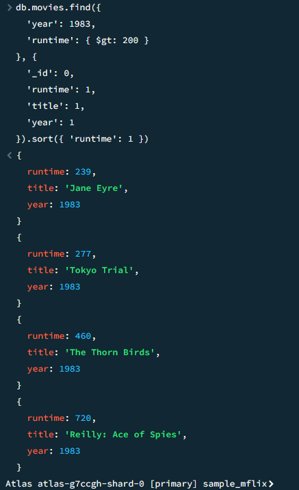
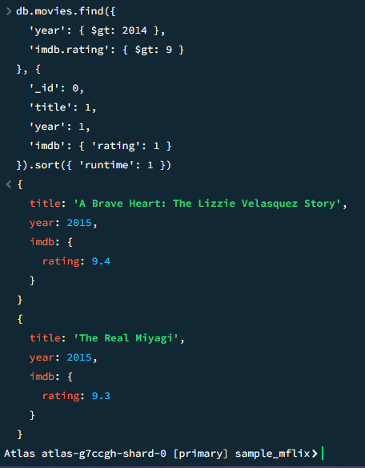

# CS-3980-Assignment-3

Assignment 3: MongoDB Setup and Queries

1. All movies with a `runtime` greater than 200 minutes in `year` 1983:

    

2. All movies after `year` 2014 with an `imdb rating` greater than 9:

    
